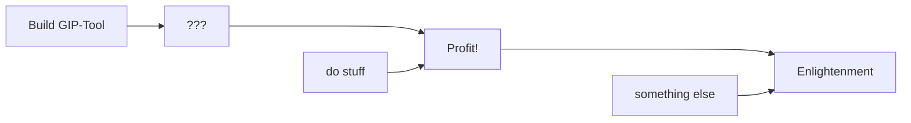

# Go Static Site Generator

This is a static site generator written in Go, optimized for use with Foam. It renders a directory tree of markdown files on-the-fly.

Just run the container with docker and mount your markdown files at `/markdown-renderer/docs`:

```shell
docker run --rm -ti -v ~/your/files:/markdown-renderer/docs stefanfritsch/go-markdown-renderer
```

Those files have to be world-readable or you have to fix their owner and permissions. E.g. if the docs are baked into the Dockerfile:

```Dockerfile
ADD docs/ /markdown-renderer/docs

RUN  chown -R markdown-renderer:markdown-renderer /markdown-renderer/docs \
  && chmod -R 0550 /markdown-renderer/docs
```

The container will listen on port `8090` unless you set the variable `PORT` via docker.

!!!!notify Hidden files
    The app will by hide files and directories starting with "." or "_", e.g.
    ```
    .vscode/
    _layouts/
    ```
    
    **as well as** any directory with one of the following two names:
    ```
    assets
    deps
    ```
    
    This is currently hardcoded.
!!!!

## Configuration

You can specify the following environment variables:

* `BASEDIR`: The basedir of the URL path. E.g. "`/docs`" if you want to serve your files below `https://example.com/docs`. Default is "" which serves at the domain root.
* `PORT`: The port to listen on (default: "`8090`")
* `TITLE`: The site title (default: "Markdown Renderer")
* `ICON`: The site logo. A valid class string for [fontawesome](https://fontawesome.com/icons/). Default is "`fa-solid fa-book`"

## Functionality

### Diagrams



### Math

$$
\int_0^{2\pi} e^{ix}\,dx = 0
$$

### Fenced Containers

:::: {.note .important .green}
#huhu: missing
This is missing

:::{.red}
This is *emphasized*, **really** emphasized.
:::

> this is a quote

#### This is a header

::::

> that
> too

### Admonitions

You can add

!!!!note Important notes
    Notes inside admonitions
!!!!

as well as

!!!danger Dangerous Mistakes
    Highlight dangerous mistakes
!!!


### File Trees

Simply wrap an `<ul>` in an element with class `.filetree` using fences.

:::{.filetree}
* `file A`
* `dir A/`
  * `file B`
  * `file C`
* `dir B/`
  * `dir C/`
    * `file D`
:::
