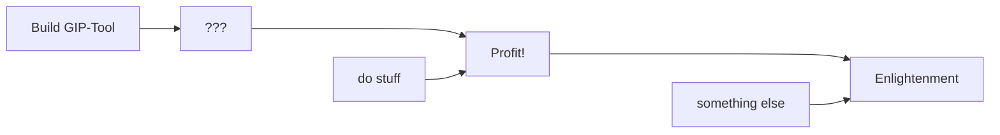

# Go Static Site Generator

This is a static site generator written in Go -- optimized for use with Foam. It renders a directory tree of markdown files, including [[Subdirectory|subdirectories]] on-the-fly.

Just run the container with docker and mount your markdown files at `/markdown-renderer/docs`:

```shell
docker run --rm -ti -v ~/your/files:/markdown-renderer/docs stefanfritsch/go-markdown-renderer
```

The container will listen on port `8090` unless you set the variable `PORT` via docker.

## Configuration

You can specify the following environment variables:

* `PORT`: The port to listen on (default: "8090")
* `TITLE`: The site title (default: "Markdown Renderer")


# Level 1
## Level 2
### Level 3
#### Level 4
##### Level 5
###### Level 6

## Functionality

### Text

Markdown is a way to write human-readable text files that can be rendered nicely as html or pdf. Simply write text as usual.
Line breaks work as expected.

Empy lines start a new paragraph.

You can *emphasize* and **embolden** text by wrapping it in asterisks (`*`):

```markdown
I can turn text *italic* and **bold**!
```

Headers are created with the pound sign (`#`). More signs means smaller headers, the deepest level that exists is 6 (`######`):

#### This is level 4

some text

##### This is level 5

more text

###### This is level 6

The smallest header that exists in html


### Images

Images work as usual in markdown with the `` syntax:


There are no special features like floats, captions or such. Use [[fences-example]] if you need them.

### Tables

First Column | Centered Column | Third Column | Right-aligned Column
------|:---------:|-------|-------:
Some | Text | some | 0.01
Some | Text | some | 0.02
Some | Text | some | 0.03
Some | Text | some | 0.04
Some | Text | some | 123120.05

### Diagrams

#### Mermaid



#### draw.io

VSCode has excellent support for draw.io images using the drawio extension. These can be opened like normal `.png` or `.svg` files but can be edited in VSCode in the diagram editor of the extension.


### Wider body

Use fenced containers for a wider content area:

::::{.wide}

::::

### Math

$$
\int_0^{2\pi} e^{ix}\,dx = 0
$$

### Fenced Containers

see also the [[fences-example]]

:::: {.note .important .green}
  #huhu: missing
  This is missing

  :::{.red}
  This is *emphasized*, **really** emphasized.
  :::

  > this is a quote

  #### This is a header

::::

> that
> too

### Admonitions

You can add

!!!!note Important notes
    Notes inside admonitions
    
    ```R
    and <- code("blocks")
    ```
!!!!

as well as

!!!danger Dangerous Mistakes

Highlight dangerous mistakes

!!!


### File Trees

Simply wrap an `<ul>` in an element with class `.filetree` using fences.

:::{.filetree}
`my root`
* `file A`
* `dir A/`
  * `file B`
  * `file C`
* `dir B/`
  * `dir C/`
    * `file D`
:::


[//begin]: # "Autogenerated link references for markdown compatibility"
[Subdirectory|subdirectories]: Subdirectory/Subdirectory.md "Subdirectory"
[fences-example]: fences-example.md "Goldmark-Fences"
[//end]: # "Autogenerated link references"